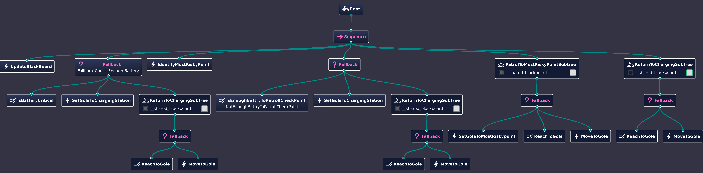

# Autonomous Patrolling Robot in ROS 2

## Overview
This project implements an autonomous patrolling robot using ROS 2 and Behavior Trees.CPP. The system features waypoint navigation, dynamic obstacle avoidance, and behavior-based decision making without any Python dependencies.

## Key Features
- Pure C++ implementation (ROS 2 Humble/Iron)
- BehaviorTree.CPP for decision making
- Nav2 integration for path planning
- Custom action servers for patrol behaviors
- Gazebo simulation support

## Dependencies
- ROS 2 Humble or Iron
- BehaviorTree.CPP (v3.x)
- Nav2
- Gazebo (for simulation)

## Installation

### 1. Clone and Build
```bash
git clone https://github.com/priyanshu28012002/patrolling_bot.git
cd patrolling_bot
rosdep install -i --from-path src --rosdistro $ROS_DISTRO -y
colcon build --symlink-install
source install/setup.bash
```

### 2. Install Dependencies
```bash
# Install BehaviorTree.CPP
sudo apt install ros-$ROS_DISTRO-behaviortree-cpp

# Required ROS 2 packages
sudo apt install ros-$ROS_DISTRO-nav2-bringup \
                 ros-$ROS_DISTRO-gazebo-ros
```

### Launch Simulation
```bash
ros2 launch cpp_patrolling_bot patrol_bot.launch.py
```

## Behavior Tree XML



